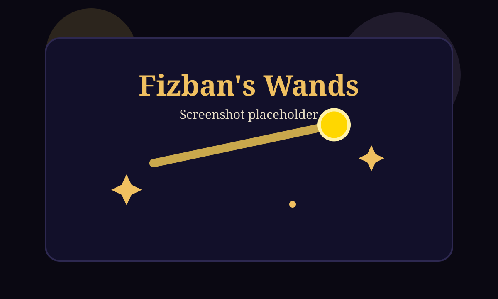

# Fizban's Wands

A polished React + Vite static e-commerce storefront for **Fizban's Wands**, a whimsical magical wand shop inspired by Fizban from Dragonlance Chronicles.



Live demo: https://cindy-pi.github.io/ai-storefront-gpt/

## Running Locally

Install dependencies:

```bash
npm install
```

Start Vite:

```bash
npm run dev
```

Visit `http://localhost:5173/ai-storefront-gpt/`.

## Running the Build

Create a production build:

```bash
npm run build
```

The compiled static site is written to `dist/`.

## Live Demo

The GitHub Pages target is `https://cindy-pi.github.io/ai-storefront-gpt/`.

The Vite base path is configured as `/ai-storefront-gpt/` in `vite.config.js` so assets load correctly from the repository Pages path.

## About the Shop

Fizban's Wands is a fantasy-themed storefront with a starry home page, alignment-based catalog, wand detail modal, shopping cart, checkout, and a parchment-style delivery confirmation.

The shop uses bespoke vanilla CSS with a dark magical palette, gold accents, responsive grids, and generated SVG wand art for every product.

## Seed Data

Seed data lives in `src/data/wands.js`.

The catalog contains 36 wands across three alignments:

- 12 Good wands
- 12 Neutral wands
- 12 Evil wands

Each wand includes an id, name, alignment, description, price, magical properties, rarity, wood, core, length, and color.

To add more wands, append another object to the exported `wands` array using the same shape. The catalog filters, counts, sort controls, cart, and receipt rendering will pick it up automatically.

## Customer Credits

Every customer starts with `1,000gp`.

The balance persists in localStorage under `fizban_balance`. Cart contents persist under `fizban_cart`, and previous purchases persist under `fizban_history`.

To reset only the balance, clear `fizban_balance` from localStorage. To reset the full demo state, clear all three keys.

## Checkout

Checkout requires a traveler name and email address for display-only owl-post records. No backend or real payment service is used.

The cart summary includes subtotal, 10% tax, and grand total. If the order total is greater than the current gold balance, checkout is disabled and an insufficient-funds warning is shown.

When checkout succeeds, the app deducts gold from the stored balance, saves the order to purchase history, clears the cart, and navigates to the confirmation page.

## Simulated Email Receipt

The confirmation page displays a **Magical Delivery Parchment** instead of sending a real email.

Because this is a static GitHub Pages site with no backend or external APIs, the receipt is simulated in-browser and saved to localStorage as purchase history. The parchment includes order number, date, customer name, each purchased wand with SVG art, a wax seal, and the owl-post delivery timeframe.

## Deploying to GitHub Pages

1. Fork or clone the repository.
2. Install dependencies with `npm install`.
3. Push changes to `main`.
4. GitHub Actions runs `.github/workflows/deploy.yml`.
5. The workflow installs with `npm ci`, runs `npm run build`, uploads `dist/`, and deploys through GitHub Pages.
6. The deployed site becomes available at `https://cindy-pi.github.io/ai-storefront-gpt/`.

## GitHub Repository Settings

GitHub Pages must be configured to deploy from Actions:

`Settings` → `Pages` → `Source` → `GitHub Actions`
